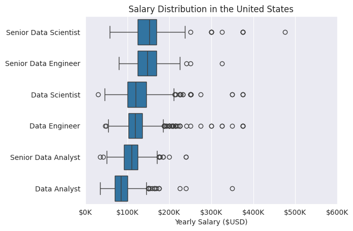
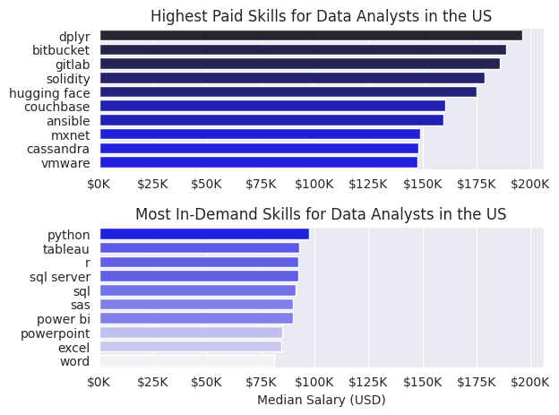
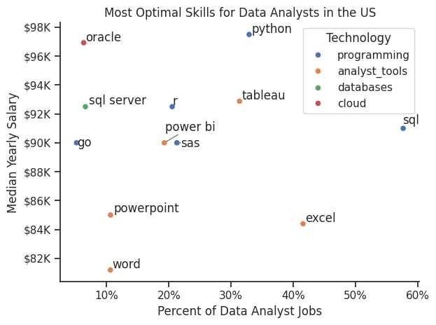

# Introduction
Welcome to my analysis of the data job market, with a particular focus on data analyst roles. This project was created out of a desire to navigate and understand the job market more effectively. It examines high-paying skills and those most in demand, with the goal of identifying the best opportunities for data analysts.

The dataset, originally sourced from Luke Barousse's Python course, serves as the foundation for this analysis. It includes comprehensive details on job titles, salaries, locations, and key skills. Through a series of Python scripts, I explore critical questions such as the most in-demand skills, salary patterns, and how skill demand correlates with salary trends in the field of data analytics.

# Questions
Below are the questions I want to answer in my project:

- What are the skills most in demand for the top 3 most popular data roles?
- How are in-demand skills trending for Data Analysts?
- How well do jobs and skills pay for Data Analysts?
- What are the optimal skills for data analysts to learn? (High Demand AND High Paying)

# Tools Used
- Python: The core tool for data analysis and insights, using these key libraries:
    - Pandas Library: For data manipulation.
    - Matplotlib Library: For data visualization.
    - Seaborn Library: For more advanced visualization.
- Jupyter Notebooks: To run Python scripts and integrate notes seamlessly.
- Pycharm: As the primary development environment.

# Data Preparation and Cleanup
## Import & Clean Up Data
I start by importing necessary libraries and loading the dataset, followed by initial data cleaning tasks to ensure data quality.
```python
#Importing Libraries
import ast
import pandas as pd
import seaborn as sns
from datasets import load_dataset
import matplotlib.pyplot as plt

# Loading Data
dataset = load_dataset('lukebarousse/data_jobs')
df = dataset['train'].to_pandas()

# Data Cleanup
df['job_posted_date'] = pd.to_datetime(df['job_posted_date'])  # converting job_posted_date to datetime object
df['job_skills'] = df['job_skills'].apply(lambda data: ast.literal_eval(data) if pd.notna(data) else data)  # converting job_skills to list
```
## Filter US Jobs
To focus my analysis on the U.S. job market, I apply filters to the dataset, narrowing down to roles based in the United States.
```python
df_US = df[df['job_country'] == 'United States']
```

# The Analysis

## 1. What are the most demanded skills for the top 3 most popular data roles in the United States?

To identify the most in-demand skills for the three most popular data-related roles, I filtered the job positions by popularity and extracted the top five skills for each of these roles. This query highlights the most common job titles and their key skills, providing insight into which skills I should focus on based on the role I am aiming for.

View my notebook with detailed steps here:
[2_Skill_Demand.ipynb](project/2_Skill_Demand.ipynb)

### Results


*Bar graph visualizing the salary for the top 3 data roles and their top 5 skills associated with each.*

### Insights
- SQL is the most requested skill for Data Analysts and Data Engineers, with it in over half the job postings for both roles. For Data Scientists, it is the second most required skill after Python, appearing in 51% of job postings.
- Data Engineers require more specialized technical skills (AWS, Azure, Spark) compared to Data Analysts and Data Scientists who are expected to be proficient in more general data management and analysis tools (Excel, Tableau).
- Python is a versatile skill, highly demanded across all three roles, but most prominently for Data Scientists (72%) and Data Engineers (65%).

## 2. How are in-demand skills trending for Data Analysts?

To identify how skills are trending in 2023 for Data Analysts, I filtered data analyst positions and grouped the skills by the month the job postings were made. This allowed me to find the top 5 skills for data analysts by month, showing how the popularity of these skills evolved throughout 2023.

View my notebook with detailed steps here:
[3_Skill_trend.ipynb](project/3_Skill_Trend.ipynb)

### Results


*Line graph visualizing the trending of top skills for data analysts in the US over the months in 2023.*


### Insights
- SQL remains the most consistently in-demand skill throughout the year, though it shows a gradual decline in demand over time.
- Excel saw a significant increase in demand starting around September, eventually surpassing both Python and Tableau by the end of the year.
- Both Python and Tableau maintained relatively stable demand throughout the year with some fluctuations, but they remain essential skills for data analysts. Power BI, although less in demand compared to the others, shows a slight upward trend toward the year's end.

## 3. How well do jobs and skills pay for Data Analysts?

To identify the highest-paying roles and skills, I focused on jobs in the United States and analyzed their median salaries. First, I examined the salary distributions for common data-related roles, such as Data Scientist, Data Engineer, and Data Analyst, to get a sense of which positions offer the highest pay.

View my notebook with detailed steps here: 
[4_Salary_Analysis.ipynb](project/4_Salary_Analysis.ipynb)

### Results


*Box plot visualizing the salary distributions for the top 6 data job titles.*


### Insights
- There is significant variation in salary ranges across different job titles. Senior Data Scientist positions offer the highest earning potential, with salaries reaching up to $500K, highlighting the high value placed on advanced data skills and experience in the industry.
- Both Senior Data Engineer and Senior Data Scientist roles show a considerable number of outliers at the higher end of the salary spectrum, suggesting that exceptional skills or circumstances can lead to substantial pay in these positions. In contrast, Data Analyst roles display more consistency in salary, with fewer outliers.
- Median salaries increase with seniority and specialization. Senior roles, such as Senior Data Scientist and Senior Data Engineer.
- Interestingly, Senior Data Analyst positions offer lower salaries compared to regular Data Engineer and Data Scientist roles, highlighting the higher market value of technical and specialized skills over seniority in analysis positions.
 
### Highest Paid & Most Demanded Skills for Data Analysts
Next, I refined my analysis to focus exclusively on data analyst roles. I examined both the highest-paying and most in-demand skills, presenting the results using two bar charts.
### Results


*Two bar graphs visualizing the highest paid and most in-demand skills for data analyst in US in 2023*

### Insights
- The top graph shows that specialized technical skills like dplyr, Bitbucket, and GitLab are associated with higher salaries, with some reaching up to $200K. This suggests that advanced technical proficiency can significantly boost earning potential. Still we have to remember that this conclusion is based on very few data.
- The bottom graph highlights that foundational skills like Excel, PowerPoint, and SQL are the most in-demand, even though they may not command the highest salaries. This underscores the importance of these core skills for employability in data analysis roles.
- There is a clear distinction between the highest-paying skills and those most in demand. Data analysts looking to maximize their career potential should aim to develop a diverse skill set, incorporating both high-paying specialized skills and widely sought-after foundational abilities.

## 4. What is the most optimal skill to learn for Data Analysts

To identify the most optimal skills to learn (both highly paid and in high demand) I calculated the percentage of demand for each skill along with their median salaries. This analysis helps to clearly determine which skills offer the best opportunities for learning.

View my notebook with detailed steps here: 5_Optimal_Skills.

### Results


*A scatter plot visualizing the most optimal skills (high paying & high demand) for data analysts in the US with color labels for technology.*

### Insights
- Commonly required skills like Excel and SQL are prevalent in job listings but tend to have lower median salaries compared to more specialized skills such as Python and Tableau. This suggests that while these common skills are valued, more specialized expertise can lead to higher earnings.
- The scatter plot indicates that programming skills (colored blue) generally cluster at higher salary levels compared to other categories. This implies that proficiency in programming may offer greater financial benefits in the data analytics field.
- Database skills (colored red), such as Oracle, are associated with some of the highest salaries among data analyst tools. This indicates a significant demand and high valuation for expertise in data management and manipulation within the industry.

# What I Learned
Throughout this project, I deepened my understanding of the data analyst job market and enhanced my technical skills in Python, especially in data manipulation and visualization. Here are a few specific things I learned:

- Advanced Python Usage: Utilizing libraries such as Pandas for data manipulation, Seaborn and Matplotlib for data visualization, and other libraries helped me perform complex data analysis tasks more efficiently.
- Data Cleaning Importance: I learned that thorough data cleaning and preparation are crucial before any analysis can be conducted, ensuring the accuracy of insights derived from the data.
- Strategic Skill Analysis: The project emphasized the importance of aligning one's skills with market demand. Understanding the relationship between skill demand, salary, and job availability allows for more strategic career planning in the tech industry.

# Conclusion
Through this project, I gained a deeper understanding of the data analytics job market, specifically the importance of aligning one’s skillset with both demand and salary potential. Foundational skills like SQL and Excel are indispensable for most roles, but mastering more specialized tools and technologies (like Python, Tableau, or advanced databases) opens up higher-paying opportunities.
